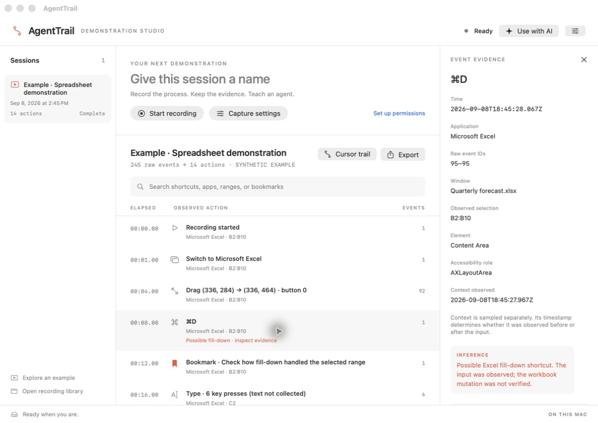
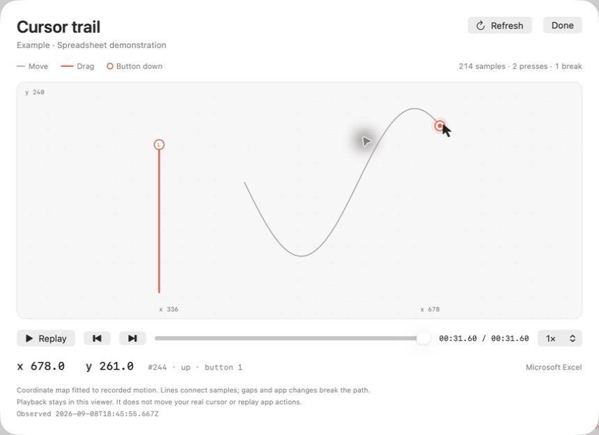

# AgentTrail

**Record desktop demonstrations for computer-use agents.**

**Experimental · macOS · source-only release · MIT**

AgentTrail is a local macOS app that records keyboard and pointer inputs, samples application context, and turns a demonstration into a searchable timeline. Export the raw events and grouped actions for dataset preparation, agent evaluation, or a conversation with an AI assistant.

Press Start, work in your apps, and stop recording. Review the unsaved draft, then choose **Save recording** to keep it or **Discard** to release it. Recording data and screenshots stay in memory until you explicitly save.



*The native app displaying a synthetic demonstration—not a real recording. This example uses a spreadsheet; input recording works across apps.*

**Privacy warning:** this is an input recorder. Raw key codes can reveal typed content even with text capture disabled. Record your own authorized demonstrations using disposable data; never use it for covert monitoring. The repository contains source, synthetic test generators, and reviewed synthetic-only UI screenshots, not anyone's recordings. See [Privacy and responsible use](PRIVACY.md) before capturing or sharing data.

## Quick start

Requires **macOS 14 or later**, Xcode 15+ or Apple Command Line Tools with the macOS 14+ SDK, Swift 5.9+, and Git. There are no downloaded package dependencies. This initial publication has **no prebuilt/notarized installer**; build locally:

```sh
git clone https://github.com/mctatge/AgentTrail.git
cd AgentTrail
bash scripts/build-app.sh
open dist/AgentTrail.app
```

If developer tools are missing, run `xcode-select --install` and complete Apple's installer first. [Installation and troubleshooting](docs/installation.md) covers permissions, updates, and removal.

After the first build, double-click **Open AgentTrail.command** or the app in `dist/`.

1. Open **Capture settings**. Enable **Input Monitoring** for keys/pointer and **Accessibility** for context in macOS System Settings. If AgentTrail is absent, use the **+** button, press **Command–Shift–G**, navigate to this checkout's `dist/` folder, and choose **AgentTrail.app**. Quit and relaunch after permission changes. Screen Recording and Excel Automation are optional.
2. Give the demonstration a name and press **Start recording**.
3. Work in a native app or a browser. **Control–Option–Command–P** pauses/resumes; **Control–Option–Command–M** adds a bookmark. The shortcuts are listen-only and may also reach the foreground app.
4. Press **Stop recording**. Search the unsaved timeline and select an action to inspect its raw evidence.
5. Choose **Save recording** to add it to your library, or **Discard**. Export and AI queries are available for saved recordings. Save or discard the draft before starting another recording.

**Explore an example** opens a clearly labeled synthetic spreadsheet draft without recording computer input. It also remains unsaved until you choose **Save recording**.

Start with a short disposable test: type a phrase in another app, drag, pause, resume, and stop. Confirm that the timeline contains actual key and pointer events, not only context observations. A prior local export contains key, pointer, and resize evidence; full physical capture through Save, Quit/reopen, export, and cancellation remains pending. See [validation status and acceptance protocol](docs/validation.md#physical-capture-audit--2026-10-07); do not assume lossless capture or production readiness.

## Cursor trails

Open a session and click **Cursor trail**, or select a movement/drag/click action and choose **View cursor trail** in its inspector. The coordinate map draws the recorded path, distinguishes movement from dragging, and marks mouse-button presses. Replay it at ½×, 1×, 2×, or 4×, scrub through time, or step between individual samples to inspect x/y coordinates, timestamps, and raw event IDs.



*Synthetic cursor samples: movement in gray, dragging in red, and circles for button presses. The viewer links each sample to its coordinates, timestamp, and raw event ID.*

The map preserves aspect ratio and negative coordinates. It fits the captured motion rather than placing the trail over an unregistered screenshot. Gaps, pause/resume boundaries, app switches, and idle intervals over two seconds break the path. Playback only visualizes recorded data; it never moves your actual pointer or operates an app. Longer recordings are split into navigable parts of up to 20,000 relevant records, without deleting or modifying raw events. Refresh loads newly committed samples during a recording.

## What is captured

| Input or observation | Included |
| --- | --- |
| Keyboard | Key down/up, physical key code, modifier flags, repeat state; ANSI display labels |
| Pointer | Coordinates, movement, button down/up, drag samples, button number, click count |
| Scroll | Horizontal/vertical point deltas and continuous-scroll flag |
| Time | UTC receipt timestamps, OS input timestamps, ordered database event IDs |
| Context | App and bundle ID, focus changes, sampled window and accessible element metadata |
| Window geometry | Observed focused-window size changes with before/after frames when Accessibility exposes them |
| Clipboard | Change observations and type names; text is optional |
| Bookmarks | Timestamped notes for intent, unusual behavior, or labels |
| Coverage | Pause/resume, protected-input intervals, event-tap failures, interrupted sessions |

Optional settings enable Unicode text and accessibility values, clipboard text, window screenshots, and Excel workbook/sheet/selection sampling. Capture preferences persist when changed; each draft snapshots those options when started, and they become part of the saved session only when you save. Input collection begins only after an explicit Start; there is no launch-at-login service.

### Spreadsheet demonstrations

An Excel session can contain the observed `⌘D` input, a sampled `B2:B10` selection, and a possible fill-down interpretation. The interpretation is labeled as an inference: observing a shortcut does not verify that the workbook changed.

The optional Excel adapter reads selection using AppleScript and asks for macOS Automation permission on first use. It does not write cells, intercept shortcuts, or replace Excel commands. The generic accessibility adapter also attempts to read Excel's name box. Cell-level accessibility varies by version and language.

### Browsers and other apps

OS inputs work across applications. Element labels depend on what the app exposes through macOS Accessibility. Browser canvas content and some spreadsheet grids can provide little context. This release does not include a DOM extension, browser network recorder, or universal cell-change detector. Optional screenshots provide additional visual evidence.

## Dataset exports

Each export is a new folder containing:

```text
session.json       Capture options, status, environment, and counts
events.jsonl       Every committed raw input and context observation
actions.jsonl      Grouped actions with source event ranges
training.jsonl     Demonstration steps with explicitly unverified outcomes
timeline.md        A readable timeline for review or AI attachment
sessions/...      Optional screenshot attachments
```

Save a recording before exporting it. The action builder groups mouse movements, drag gestures, scroll bursts, and typing. Raw data remains available. Saved recordings have no automatic deletion or retention limit in this release; manage the local library and exported copies yourself.

The training format is an intermediate dataset, not a model-specific fine-tuning format or a replay program. Synthetic examples are labeled as synthetic. The recorder cannot reliably distinguish physical human inputs from generated OS inputs.

## Query with an AI

Use **Use with AI** in the app to copy an MCP configuration with the correct executable path, or attach an exported `timeline.md` to your conversation.

Example request:

> Find every fill-down shortcut and drag in this session. Show the observed selection, supporting event IDs, and anything the log cannot verify.

The embedded MCP server uses stdio and exposes only `list_sessions`, `search_actions`, and `get_events`. It opens the saved library read-only and has no capture, modification, shell, or arbitrary SQL tool. Unsaved drafts are unavailable to MCP and the CLI. See [AI integration](docs/ai-integration.md) for configuration and paging.

AgentTrail makes no network requests. If you connect an AI client, that client's handling of returned data determines whether recording contents leave your Mac.

Connecting MCP gives that client read access to **every saved session in the selected local library**, not just the one selected in the app. Session IDs are query filters, not authorization boundaries. For a narrower scope, record into a separate `--root` library. Review data before allowing a client to retrieve it.

## Local data and capture controls

New recordings use an in-memory SQLite database and in-memory screenshot bytes. Starting, pausing, and stopping do not add a recording to the library. **Save recording** is the explicit persistence step; **Discard** releases the draft. An unexpected exit loses the entire unsaved draft. This describes AgentTrail’s own storage behavior, not a guarantee against macOS swap, crash dumps, or memory recovery. Discard is not secure erasure.

The saved library defaults to `~/Library/Application Support/AgentTrail/`. Directories are created owner-only and the database and exported raw records use owner-only file permissions. The durable SQLite database uses WAL transactions. These controls are not encryption.

After saving, the complete raw log lives in the **events table of `library.sqlite`**. Use **Open recording library** in the sidebar to find it. While the app is open, SQLite's neighboring `-wal` and `-shm` files may contain live database state; use Export or the CLI rather than copying just the database file.

For terminal use, `AgentTrail raw SESSION_ID` streams every saved raw event as JSONL without a 500-record cap. Redirect stdout to save a plain-text log. The GUI, CLI, and MCP server share the saved library; the GUI alone can review its current in-memory draft. `--follow` remains available for legacy on-disk sessions, but does not expose new unsaved recordings.

Keyboard codes can reconstruct typed content even with literal text disabled. Common password-manager bundle IDs are excluded by default; the app suppresses capture during macOS secure input and recognized accessible password fields. Detection depends on the application. Pause before entering credentials or leaving a demonstration. Screenshots can contain unrelated visible information inside the captured app window.

An allowlist can restrict recording to specific app bundle IDs. Recorder controls are excluded. Pausing continues to listen for the resume shortcut but does not collect ordinary inputs. Closing the workspace with an unsaved recording asks whether to keep AgentTrail running in the menu bar. With an unsaved recording, Quit offers **Save and Quit**, **Discard and Quit**, or **Cancel**; it never saves automatically.

**“Not recorded · AgentTrail controls (intentional)” is normal** when using or resizing AgentTrail itself. It is different from **“Capture gap”**, which reports actual listener failures or dropped events. Since 0.2.1, input capture runs on its own thread rather than sharing the UI thread; ordinary window resizing should not disable the listener. Earlier missing inputs cannot be reconstructed from context observations.

## Accuracy and limits

- “Raw” means events delivered by macOS, not every physical device report. macOS can coalesce pointer motion, withhold secure inputs, or disable a stalled event tap. Trackpad magnify/rotate/swipe, pressure, touch, and IME composition lifecycle events are not implemented.
- Context and screenshots are asynchronous observations with their own timestamps. They are not guaranteed pre-action states or proof of an outcome. Foreground windows are sampled; canvas cells and custom widgets may be opaque.
- Window geometry observations report an Accessibility-exposed bounds change; they do not prove that a pointer drag caused it, and apps may omit notifications or expose no focused-window geometry. Raw resize gestures remain ordinary pointer events.
- The app queues inputs and commits batches to its in-memory draft roughly every 100 ms under normal load. A crash loses the entire unsaved draft, including screenshots. Previously saved recordings remain in the library. Interrupted recordings left on disk by older versions can still be recovered and marked interrupted.
- The capture-to-UI buffer and pending/queued writer stages each have an 8,000-input budget; lifecycle markers can exceed that budget. Overflow is recorded as a capture gap. Draft-storage failures stop capture; Save failures leave the draft available for retry or discard. This is an initial release, not a lossless hardware acquisition system.
- Each draft has a 128 MiB database limit and a separate 128 MiB screenshot-byte limit. Capture stops before exhausting these limits and leaves retained evidence for review, Save, or Discard. Actual process memory is higher because buffers, decoded records, and UI images also consume memory.
- Typed/accessibility text is capped at 4,096 characters per context value, clipboard text at 16,384 characters per sample, typing summaries at 512 characters, screenshots at one request per second. Raw keystroke records retain per-event codes.
- Screenshot requests capture an available on-screen window owned by the foreground app. Apps with multiple windows can yield a different window than intended. Screenshot timing is reported as a request-to-completion interval.
- The ad-hoc signature used by default is suitable for local builds. Rebuilding or moving the app can invalidate macOS permissions. For distribution, use a stable signing identity and a separate notarization/release process. `AGENTTRAIL_SIGN_IDENTITY` selects a signing identity for the build script.

## Development

```sh
swift test
bash scripts/build-app.sh
dist/AgentTrail.app/Contents/MacOS/AgentTrail --help
```

The project contains a native SwiftUI/AppKit app and a Foundation/SQLite core. The [architecture](docs/architecture.md), [event schema](docs/schema.md), and [validation guide](docs/validation.md) explain the boundaries. CI runs tests and packages the app on macOS.

Before proposing changes, read [CONTRIBUTING.md](CONTRIBUTING.md). Before pushing, stage the intended source files and run `python3 scripts/check-publication.py`; it inspects Git's index for recordings, private paths, credentials, and unexpected file types. The check is also in CI and is not a substitute for reviewing the diff. Report vulnerabilities privately using [SECURITY.md](SECURITY.md).

AgentTrail uses Apple's public APIs and the system SQLite library. The implementation is independent; related projects worth exploring include [OpenAdapt Capture](https://github.com/OpenAdaptAI/openadapt-capture), [Screenpipe](https://github.com/screenpipe/screenpipe), and [ActivityWatch](https://github.com/ActivityWatch/activitywatch).

## License

MIT. See [LICENSE](LICENSE) and [third-party notices](THIRD_PARTY.md). This license covers the software, not rights to documents, messages, screenshots, identities, or other material a user records. No legal-compliance, anonymity, or data-rights certification is provided.
